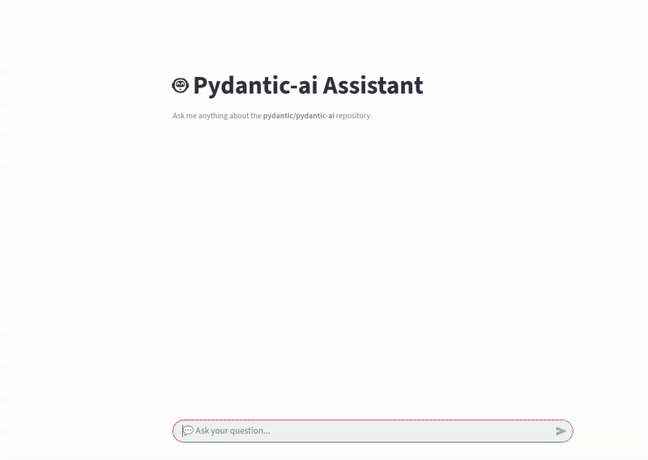

# 🤖 Pydantic-ai Assistant

An interactive AI-powered assistant for exploring and answering questions about the [pydantic/pydantic-ai](https://github.com/pydantic/pydantic-ai) repository.  
Built as a hands-on project for the [AI Agents Crash Course](https://alexeygrigorev.com/aihero/).

---

## Overview

This project demonstrates how to build modern AI agents that:
- Index and search open-source documentation
- Answer user questions with accurate, referenced responses
- Support both terminal and web chat interfaces
- Log and evaluate agent performance using structured criteria

**Why it's useful:**
- Learn practical agent architectures and search techniques
- Get instant answers about Pydantic AI with source citations
- Experiment with evaluation and logging workflows

---

## Installation

**Requirements:**
- Python 3.12+
- [uv](https://github.com/astral-sh/uv) (recommended)

```bash
# Install uv if needed
pip install uv

# Clone this repo
git clone https://github.com/zwe-htet-paing/ai-agent-crash-course.git
cd ai-agent-crash-course/code

# Install dependencies
uv pip install -r requirements.txt
```

For API key management, use [direnv](https://direnv.net/) (see `.envrc.sample`).

---

## Usage

### API Key

Set your OpenAI API key:

```bash
export OPENAI_API_KEY="your-key"
```

### Terminal Chat

```bash
uv run main.py
```

Type your question and get answers with references.  
Type `stop` to exit.


### Streamlit Web Chat

```bash
uv run streamlit run app.py
```



Visit [http://localhost:8501](http://localhost:8501) to chat in your browser.

---

## Features

- 🔎 Hybrid search (keyword + vector) over repo docs
- 🤖 AI answers with source links (using Pydantic AI + GPT-4o-mini)
- 🖥️ Terminal and Streamlit chat interfaces
- 📝 Automatic logging of all interactions
- 📊 Evaluation notebooks for agent quality

---

## Evaluation

Agent responses are evaluated on:
- `instructions_follow`: The agent followed the user's instructions
- `instructions_avoid`: The agent avoided doing things it was told not to do
- `answer_relevant`: The response directly addresses the user's question
- `answer_clear`: The answer is clear and correct
- `answer_citations`: The response includes proper citations or sources when required
- `completeness`: The response is complete and covers all key aspects of the request
- `tool_call_search`: Is the search tool invoked?


This is done in two steps:

- First, generate synthetic questions (see [`code/eval/data-gen.ipynb`](code/eval/data-gen.ipynb)).
- Next, run the agent on the generated questions and check the criteria (see [`code/eval/evaluation.ipynb`](code/eval/evaluation.ipynb)).


Current evaluation metrics:

```
instructions_follow    100.0
instructions_avoid     100.0
answer_relevant        100.0
answer_clear           100.0
answer_citations       100.0
completeness           100.0
tool_call_search       100.0
```

Key metric: The most important metric is `answer_relevant`, which measures whether the system’s answer is relevant to the user. This is currently at `100%`, meaning all answers were relevant.

Improvements: The evaluation is based on only 10 questions, so more data needs to be collected to build a comprehensive evaluation set.

---

## Project Structure

```
code/
├── main.py              # Terminal chat interface
├── app.py               # Streamlit web app
├── ingest.py            # Data ingestion and indexing
├── search_tools.py      # Search tool implementation
├── search_agent.py      # Agent configuration
├── logs.py              # Logging utility
└── eval/                # Evaluation and data generation notebooks
```

### 1. `app.py` — Streamlit Application
The main user interface for interacting with the assistant.

**Key features:**
- Chat-based interface for asking questions about the repo
- Caching for fast startup and efficient resource usage (`@st.cache_resource`)
- Session state management for conversation history

---

### 2. `ingest.py` — Data Ingestion & Indexing
Handles downloading, parsing, and chunking GitHub repository content.

**Main functions:**
- `read_repo_data(owner, repo)` — Download repo as ZIP and extract files
- `sliding_window(seq, size, step)` — Create overlapping text chunks
- `split_markdown_by_level(text, level)` — Create chunks based on markdown level
- `chunk_documents_with_sliding_windows(docs, size, step)` — Chunk docs with sliding windows
- `chunk_documents_with_markdown_sections(docs, level)` — Split Markdown by header level
- `chunk_documents(docs, method, **kwargs)` — Unified chunking entry point
- `index_data(owner, repo, chunk_method)` — Full ingestion and indexing pipeline

**Features:**
- Downloads repositories from GitHub
- Parses Markdown/MDX files
- Supports both overlapping sliding windows and header-based section splits.
- Builds a searchable index for fast retrieval

---
## 3. `search_tools.py` — Search Implementations
Implements multiple search strategies for document retrieval.

**Classes & Functions:**
- `SearchTool` — Unified interface for text, vector, and hybrid search
- `_create_embeddings()` — Generate semantic embeddings for corpus
- `index_search()` — Keyword-based search
- `vector_search()` — Semantic similarity search
- `hybrid_search()` — Combines text and vector search for best results using `Reciprocal Rank Fusion (RRF)`

---

### 4. `search_agent.py` — Agent & LLM Integration
Connects search results with a language model to generate answers.

**Main function:**
- `init_agent(index, repo_owner, repo_name)` — Initializes the agent with search tools and prompt

**Process:**
- Searches documentation using selected method
- Formats top results as context for the LLM
- Creates a structured prompt with references
- Queries the LLM (e.g., GPT-4o-mini via OpenAI)
- Returns a formatted, referenced answer

---

### 5. `main.py` — Terminal Chat Interface
Provides a CLI for interacting with the assistant.

**Features:**
- Interactive loop for Q&A
- Rich output formatting with Markdown and panels
- Logs each interaction for evaluation

---

### 6. `eval/` — Evaluation & Data Generation
Jupyter notebooks for generating synthetic questions and evaluating agent responses.

- `data-gen.ipynb` — Generates example questions and logs
- `evaluation.ipynb` — Runs checklist-based evaluation on agent answers

---

### 7. `logs.py` — Logging Utility
Handles logging of all interactions and agent responses to JSON files for later analysis.

---


## Testing

```bash
uv run pytest
```

(Minimal coverage; contributions welcome.)

---

## Deployment

To deploy on `Streamlit Cloud`:
1. Export requirements:
    ```bash
    uv export > requirements.txt
    ```
2. Push to your repo and connect to Streamlit Cloud.
3. Set `OPENAI_API_KEY` in the settings.

---

## Credits

- [Pydantic AI](https://github.com/pydantic/pydantic-ai)
- [AI Agents Crash Course](https://alexeygrigorev.com/aihero/)
- Libraries: `pydantic-ai`, `minsearch`, `streamlit`, `sentence-transformers`

---